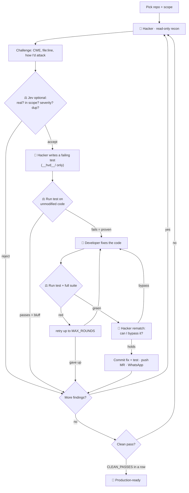

<div align="center">

# Agent vs Agent: Hacker & Developer

**An adversarial security automation for code you own.**
A Hacker agent audits your repository and *proves* each weakness with a failing test. A Developer agent fixes the code until that test — and the whole suite — pass. Round after round, until the app is **production-ready**.


-7c3aed)


</div>

---

Two agents, one codebase, a refereed duel you can read like a chat log:

- 🔴 **Hacker** — hunts for a weakness, states the challenge, and proves it by writing a regression test that **fails on today's code**.
- 🔵 **Developer** — reads the challenge, fixes the application code until that test (and the full suite) **pass**.
- ⚖️ **Referee** — the service (plus optional [Jev](https://typesafe.ai)) runs every test independently and declares a round won only when the proof is objective.

The loop repeats until a full Hacker pass finds nothing left to break. Every fix ships as a reviewed **merge request**, and you can get a **WhatsApp** message for each one.

> [!IMPORTANT]
> This is a **defensive** tool. It runs only against repository clones you own or are authorised to test, it never contacts a live or third-party system (tests run against your own code, not a deployed host), and it ships nothing without human review. **Authorization is on you.**

---

## Why it's trustworthy

The design makes it hard for either agent to cheat, and hard for the service to report a bug that isn't real:

| Guarantee | How |
|---|---|
| A finding is real, not a guess | It's only acted on once its regression test **fails on unmodified code**. No failing test → dropped as a bluff. |
| The Hacker can't touch your code | During the proof step it may only write under the test directory (`__hvd__/`); the service reverts anything else. |
| The Developer can't fake the fix | The test directory is **read-only** to it — the service reverts any test edit, then re-runs the suite itself. |
| Nothing unreviewed lands | Fixes are pushed to a branch and opened as a **merge request**; a human reviews and merges. |
| The agents can't run wild | They run headless in Claude Code's `dontAsk` mode with a strict tool allowlist. Recon is read-only. |

The whole dialogue is written to `reports/conversation.log` (human-readable) and `reports/transcript.jsonl` (structured). No UI, no server.

---

## How it works



---

## Quick start

```bash
# 1. Get the service
git clone https://github.com/nawfalajli/Agent-vs-Agent-Hacker-vs-Developer.git
cd Agent-vs-Agent-Hacker-vs-Developer

# 2. Configure (never committed)
cp .env.example .env         # fill in REPOS at least

# 3. A DEDICATED clean clone of the repo to harden
git clone <your-repo-url> /path/to/automation/app

# 4. See what the Hacker finds — no changes, no cost beyond recon
npm run harden -- --repo app --dry-run

# 5. Run the full loop until production-ready
npm run harden -- --repo app
```

**Requirements:** Node 22+ (zero npm dependencies) · git · [Claude Code](https://docs.claude.com/en/docs/claude-code) logged in (or `ANTHROPIC_API_KEY`). Merge requests use **GitLab** push options (no API token) — set `GIT_PUSH=false` to keep fixes on local branches. Jev and WhatsApp are optional.

---

## Commands

| Command | What it does |
|---|---|
| `npm run harden -- --repo <name>` | Run the loop until production-ready (or `MAX_TOTAL_ROUNDS`) |
| `npm run harden -- --repo <name> --rounds 1` | A single pass |
| `npm run harden -- --repo <name> --dry-run` | List findings only — no tests, fix, push or message |
| `npm run report` | Scoreboard from `state.json` |
| `npm test` | The service's own suite (never calls out) |

`harden` exit code: **0** production-ready · **2** ceiling reached with findings open · **1** error. Schedule recurring runs with cron / Task Scheduler.

---

## Configuration

Everything lives in `.env`; `.env.example` documents every key. The essentials:

```dotenv
# Dedicated clean clones: name|path|test command
REPOS=app|/path/to/automation/app|npm test

# Deliver each fix (or keep it local)
GIT_PUSH=true
GIT_TARGET_BRANCH=dev
MR_LABELS=security

# Where the Hacker writes its proofs (your test command must discover them)
HVD_TEST_DIR=__hvd__

# The loop
SEVERITY_MIN=medium     # below this: logged, not fixed
CLEAN_PASSES=2          # clean passes in a row = production-ready
MAX_ROUNDS=3            # fix attempts per finding
MAX_TOTAL_ROUNDS=20     # hard ceiling per run

# Model (both agents run in Claude Code, on any Anthropic-compatible provider)
LLM_PROVIDER=anthropic  # or openrouter | deepseek | qwen | kimi | glm | minimax | custom
LLM_MODEL=

# Optional referee + alerts
TYPESAFE_API_KEY=       # Jev: calibrated real/in-scope/severity/duplicate verdict
WHATSAPP_PROVIDER=      # twilio | meta | callmebot — a message for every fix
WHATSAPP_TO=
```

---

## Outcomes

Recorded per finding in `state.json`:

| Outcome | Meaning |
|---|---|
| `dismissed` | Jev/Hacker rejected it, or a bluff (no failing test) |
| `unproven` | the regression test didn't fail on current code |
| `needs-triage` | Jev confidence too low; left for a human |
| `below-threshold` | real but below `SEVERITY_MIN`; logged, not fixed |
| `unresolved` | not fixed after `MAX_ROUNDS`; proof branch left |
| `fixed` | fix + test committed, MR opened, WhatsApp sent |

Run verdict: **production-ready** (clean passes met, nothing open) or **ceiling-reached** (with the open list).

---

## Models

Both agents run inside Claude Code, so the runtime is the same on any Anthropic-compatible endpoint — only the model changes.

| Region | `LLM_PROVIDER` | Models |
|---|---|---|
| 🇺🇸 US | `anthropic` | Claude (login or API key) |
| 🇺🇸 US | `openrouter` | OpenAI GPT, Google Gemini, xAI Grok, Meta Llama, … |
| 🇨🇳 CN | `deepseek` · `qwen` · `kimi` · `glm` · `minimax` | DeepSeek, Qwen, Kimi, GLM, MiniMax |
| any | `custom` | any Anthropic-compatible endpoint (e.g. a LiteLLM proxy) |

Give the Hacker a stronger model than the Developer (or vice versa) with `HACKER_MODEL` / `DEVELOPER_MODEL`.

---

## Project structure

```
src/
  index.js      entry: --repo / --rounds / --dry-run / --report
  loop.js       the round loop + production-ready gate
  hacker.js     recon prompt, finding parsing, proof-test prompt, rematch
  developer.js  fix prompt (code only; tests read-only)
  verify.js     the proof-fails (V1) and fix-passes (V2) gates
  transcript.js turn events -> conversation.log + transcript.jsonl
  report.js     scoreboard + markdown report
  jev.js        optional referee (real / in-scope / duplicate / severity)
  git.js        branch, proof/fix isolation, commit + push -o merge_request.create
  notify.js     WhatsApp per fix (Twilio / Meta / CallMeBot)
  agent.js      headless Claude Code runner
  providers.js  US + China model providers
  config.js     .env load + validation
  state.js      state.json
  proc.js       child-process helper with timeouts
test/           node:test suites — never call out
```

---

## Testing

```bash
npm test
```

- **hacker / jev** — finding parsing, id stability, severity ordering, referee gating
- **git** — the real proof/fix isolation and local commit flow against a temp repository
- **loop** — every outcome path (fixed, bluff, unresolved, bypass, below-threshold) with the model, git and verify faked

The tests never call Claude, Jev, WhatsApp or a real remote.

---

## Security

- **Never commit `.env`** — it's git-ignored. Only `.env.example` (empty values) belongs in the repo.
- Point the service only at clones you own; it refuses a dirty tree and resets between findings.
- Every agent run is billed to your Claude Code account or provider key. With a non-Anthropic provider, code excerpts are sent there — choose one your organisation allows.
- The merge-request review is the final safety net: **always review before merging.**

---

<div align="center">

MIT · built on [Claude Code](https://docs.claude.com/en/docs/claude-code) · sibling of [clickup-dev-agent](https://github.com/nawfalajli/clickup-dev-agent)

</div>
