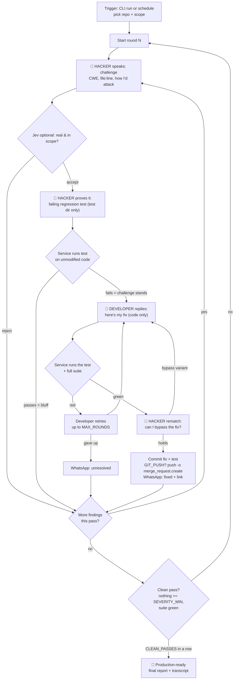

# Hacker vs Developer — service spec

> An **authorized adversarial automation you can watch like a conversation**. A pro *Hacker* agent and a *Developer* agent go round after round on a codebase you own — the Hacker challenges and tries to break, the Developer defends and fixes — and you follow the whole duel as a live chat transcript. The loop keeps running **until the app clears a production-readiness bar**. Each fix is pushed as a branch and announced on WhatsApp.

This is a defensive hardening tool. It runs against repository clones you configure and have the right to test, and never touches a live or third-party system — the regression tests run against your own code, not a deployed host. It's adversarial on purpose: the Hacker agent plays a determined attacker so weaknesses surface in your own CI instead of in the wild, and the Developer agent closes them until a full Hacker pass comes back clean. Everything the two agents say to each other is streamed to a **live conversation view** so you can see the challenges, the exploits-as-tests, and the fixes as they happen. Delivery (push, merge request, WhatsApp-per-fix) is **fully driven by `.env`**.

App-agnostic: point it at any codebase (web app, API, library, CLI) in any language whose test command you can run. It shares the engine of the [clickup-dev-agent](../click_up_automation/README.md): Node 22, zero npm dependencies, headless Claude Code, Jev (TypeSafe) as the optional judge, Git + GitLab push options, and WhatsApp. `proc.js`, `providers.js`, `git.js`, `notify.js`, `jev.js`, `state.js` are reused.

---

## 1. The idea

Two agents, one repo, a refereed debate the user watches:

- **Hacker** (red): hunts for a weakness, states the challenge in plain language, and *proves* it by writing a regression test that fails on today's code.
- **Developer** (blue): reads the challenge, explains its fix, and changes the code until that test — and the full suite — pass.
- **Hacker again**: tries to bypass the fix; if it finds a variant, the round reopens.
- **Referee** (the service + optional Jev): decides what's real, runs every test independently, and declares a round won only when the proof is objective.

Each exchange is a turn in a **conversation transcript**. Rounds repeat until a full Hacker pass finds nothing at or above `SEVERITY_MIN` — the **production-ready** bar.

---

## 2. Flow



Every 🔴/🔵 node is also a line in the live transcript (§4).

---

## 3. The two agents

Both run inside headless Claude Code. Only the model and tool allowlist differ.

| | 🔴 **Hacker** | 🔵 **Developer** |
|---|---|---|
| Job | Find a weakness, state the challenge, prove it with a failing test, then try to bypass the fix | Make the failing test pass without breaking the suite |
| Tools | `Read`, `Glob`, `Grep` for recon; `Write`/`Edit` **only under the test directory** for the proof | Edit/search the code, run `test`/`lint`/`typecheck`; test files are **read-only** |
| Commit / push | No | No — only the service commits & pushes, after its own verification |
| Transcript voice | challenges, exploit-as-test, rematch verdicts | fix rationale, what changed, residual risk |

Splitting write permissions is the core guardrail: the agent that writes the proof can't touch the code, and the agent that writes the fix can't weaken the proof. Neither can win by editing the other's test.

---

## 4. The conversation log

The duel is written to **one log file** — no UI, no server. It's the human-readable record of the run, and it reads like a professional security transcript: each turn is tied to a real artifact (a finding, a test, a diff, a test result), so the "conversation" is that sequence of artifacts, narrated, not free-chat for show.

Two files are written to `REPORT_DIR`, both local and git-ignored:

- **`conversation.log`** — the pretty, append-only transcript you read. Round-headed, speaker-labelled, timestamped, with the exploit test and diff quoted inline. `state.json` stays the machine state.
- **`transcript.jsonl`** — the same turns as structured events, one JSON per line, for tooling/grep.

Example `conversation.log`:

```
════════ Round 2 · api ════════════════════════════════════════════
[14:02:09] 🔴 HACKER — challenge · CWE-639 · HIGH
  orders.js:42 trusts :id without an ownership check.
  As user A I can read user B's order by guessing the id.
  Proof → test/security/orders_idor.test.js

[14:02:21] ⚖️ REFEREE — proof-result
  Test FAILS on current code. Challenge stands.

[14:03:40] 🔵 DEVELOPER — fix
  Added assertOwner(session.user, order) before serialising; 403 otherwise.
  Changed: src/routes/orders.js (+6 −1)

[14:03:58] ⚖️ REFEREE — test-result
  Regression test PASSES. Full suite PASSES (142/142).

[14:04:12] 🔴 HACKER — rematch
  Tried id as array, and the sibling /orders/:id/items path. Both 403. Holds.

[14:04:13] ⚖️ REFEREE — round-result · FIXED
  Pushed hvd/639-order-idor (a1f9c3e) · MR !128
```

Each JSONL event: `actor` ∈ `hacker | developer | referee`; `kind` ∈ `challenge | proof-result | fix | test-result | rematch | round-result | verdict`.

---

## 5. Jev as the referee (optional)

Jev ([TypeSafe System One](https://typesafe.ai)) takes the calibrated call on each challenge: `real` (yes/no), `in_scope` (yes/no), `severity` (choice), `duplicate` (yes/no). Below `JEV_MIN_CONFIDENCE` the challenge is parked as *needs triage* (shown in the transcript, not acted on). Without `TYPESAFE_API_KEY` the Hacker's call stands — but a challenge still only counts once its test **fails on unmodified code** (`V1`), so a bluff with no failing test is dropped automatically.

---

## 6. Production-ready bar

The loop stops when the Hacker can't win:

- `CLEAN_PASSES` consecutive full passes (default `2`) find nothing at or above `SEVERITY_MIN`, **and**
- the full test suite is green, **and**
- no finding is left in `unresolved`.

Then the service writes a final report + the full transcript and (if `WHATSAPP_EVENTS` includes `ready`) sends one "production-ready" message. A hard ceiling `MAX_TOTAL_ROUNDS` stops a run that never converges, and the report says what's still open.

---

## 7. Guardrails

| Concern | How it's handled |
|---|---|
| Attacking systems we don't own | Only configured local repo **clones** are touched. Agents have no network tools; tests run against the clone, never a live host. |
| A challenge that proves nothing | Counts only if its regression test **fails on unmodified code**. No failing test → dropped (shown as a bluff in the transcript). |
| A fix that cheats the test | Developer can't edit the test dir (read-only). The service re-runs the exact test + full suite itself before pushing. |
| Unreviewed fixes reaching the target branch | Pushed to a task branch, never the target directly. A **merge request** is opened for a human to review and merge. |
| Agents running arbitrary commands | `dontAsk` mode with an allowlist: file edit/search, `npm test/lint/typecheck`, test runners, `git status/diff/log`. Everything else denied. Recon is read-only. |
| A loop that never ends | `MAX_ROUNDS` per finding, `MAX_TOTAL_ROUNDS` per run; then it reports and stops. |
| Leaking findings | MRs carry a `security` label; WhatsApp goes only to the configured owner number; the transcript is local. |
| Touching your working copy | Each repo is a dedicated clone; dirty tree refused; reset after every finding (git-ignored files like `.env` kept). |

**Authorization is on the operator.** Only configure repositories you own or are explicitly authorized to test.

---

## 8. Configuration (`.env`)

Only `.env.example` is committed.

### Repositories & git push

| Key | Default | Description |
|---|---|---|
| `REPOS` | | `name\|path\|test command` entries, `;`-separated; dedicated clean clones |
| `DEFAULT_REPO` | first | Repo used when `--repo` isn't given |
| `GIT_PUSH` | `true` | Push each fix branch. `false` = local branch only. |
| `GIT_REMOTE` / `GIT_TARGET_BRANCH` / `GIT_BRANCH_PREFIX` | `origin` / `dev` / `hvd/` | Push target + branch naming |
| `MR_LABELS` | `security` | Labels added via push options to each MR |

Pushed with `git push -o merge_request.create -o merge_request.target=$GIT_TARGET_BRANCH` (GitLab opens the MR, no API token). Other remotes: branch pushes, open the PR manually.

### Models & Jev

| Key | Default | Description |
|---|---|---|
| `LLM_PROVIDER` / `LLM_MODEL` | `anthropic` | Model behind both agents (US or China presets) |
| `HACKER_MODEL` / `DEVELOPER_MODEL` | `LLM_MODEL` | Optional per-agent models (e.g. a stronger model for the Hacker) |
| `TYPESAFE_API_KEY` / `JEV_MIN_CONFIDENCE` | — / `0.7` | Optional Jev referee + gate |

### Loop & conversation

| Key | Default | Description |
|---|---|---|
| `SEVERITY_MIN` | `medium` | Findings below this are shown but don't block readiness |
| `CLEAN_PASSES` | `2` | Consecutive clean passes required to call it production-ready |
| `MAX_ROUNDS` | `3` | Fix attempts per finding |
| `MAX_TOTAL_ROUNDS` | `20` | Hard ceiling on rounds per run |
| `MAX_FINDINGS_PER_PASS` | `5` | Cap on findings handled per pass |
| `HUNT_SCOPE` | whole repo | Path globs, e.g. `src/**,!src/vendor/**` |
| `REPORT_DIR` | `./reports` | `conversation.log`, `transcript.jsonl`, report, scoreboard (git-ignored) |

### WhatsApp — a message for every fix

Reused verbatim from the sibling; sent **per fix** (and per the other opted-in events), to the owner only.

| Key | Default | Description |
|---|---|---|
| `WHATSAPP_PROVIDER` | | `twilio`, `meta` or `callmebot`. Empty = off. |
| `WHATSAPP_TO` | | Owner's number, international format |
| `WHATSAPP_EVENTS` | `fixed,unresolved,ready` | Include `fixed` to message on **every fix**; `ready` for the production-ready milestone |
| `TWILIO_*` / `META_*` / `CALLMEBOT_API_KEY` | | Provider credentials |

Example per-fix message:

```
✅ Hacker vs Developer: FIXED (round 2)
[CWE-639] Order endpoint returns other users' orders (high)
Repo: api · hvd/639-order-idor (a1f9c3e)
MR: https://gitlab.com/<group>/api/-/merge_requests/128
```

---

## 9. Commands

| Command | What it does |
|---|---|
| `npm run harden -- --repo <name>` | Run the full loop until production-ready (or `MAX_TOTAL_ROUNDS`) |
| `npm run harden -- --repo <name> --rounds 1` | A single pass (one round of challenges) |
| `npm run harden -- --repo <name> --dry-run` | Hacker finds + narrates only; no tests, no fix, no push, no message |
| `npm run report` | Scoreboard from `state.json` |
| `npm test` | The service's own suite |

---

## 10. Outcomes (per finding, in `state.json` + transcript)

| Outcome | Meaning | WhatsApp (if opted in) |
|---|---|---|
| `dismissed` | Jev/Hacker rejected, or a bluff (no failing test) | — |
| `needs-triage` | Jev confidence too low | optional |
| `unresolved` | not fixed after `MAX_ROUNDS`; PoC branch left | yes |
| `fixed` | fix + test pushed, MR opened | **yes — one per fix** |

Run-level: `production-ready` when the bar in §6 is met (one `ready` message), else `ceiling-reached` with the open list.

---

## 11. Project structure

```
hacker-vs-developer/
├── src/
│   ├── index.js      # entry: --repo / --rounds / --dry-run, graceful stop
│   ├── loop.js       # the outer round loop + production-ready gate
│   ├── hacker.js     # recon prompt, challenge parsing, proof-test prompt, rematch
│   ├── developer.js  # fix prompt (code only, tests read-only) + BLOCKED handling
│   ├── verify.js     # runs the single test, then the full suite, in the clone
│   ├── transcript.js # turn events -> conversation.log (pretty) + transcript.jsonl
│   ├── report.js     # final report + scoreboard
│   ├── jev.js        # reused: referee verdict + gating
│   ├── providers.js  # reused: US + China model providers
│   ├── git.js        # reused: branch, commit, push -o merge_request.create, cleanup
│   ├── notify.js     # reused: WhatsApp per fix, owner only
│   ├── config.js     # .env load + validation
│   ├── state.js      # reused: state.json
│   └── proc.js       # reused: child-process helper
├── test/             # node:test suites; never calls out
├── reports/          # conversation.log, transcript.jsonl, report, scoreboard (git-ignored)
├── .env.example
└── package.json
```

Versus the ClickUp sibling: `clickup.js` dropped; `loop.js` and `transcript.js` added; `git.js` + `notify.js` kept.

---

## 12. Build order

1. Fork the clickup-dev-agent layout; keep `providers.js`, `git.js`, `notify.js`, `jev.js`, `state.js`, `proc.js`; drop `clickup.js`.
2. `transcript.js` first — the event schema + the `conversation.log` formatter are the backbone every other module writes to.
3. `hacker.js` — recon → JSON challenges; proof-test prompt (test dir only); rematch prompt.
4. `verify.js` — the failing-test gate (`V1`) and the pass gate (`V2`).
5. `developer.js` — fix prompt with the test dir read-only.
6. `loop.js` — one round (challenge→proof→fix→rematch), then the outer loop + the §6 readiness gate; wire `notify('fixed'|'ready', …)` and the push.
7. `report.js` + `config.js` — report/scoreboard and key validation (`GIT_PUSH`, loop keys, WhatsApp block).
8. Tests: challenge-parse, the two verify gates (fixture repo with one planted weakness), the readiness gate (clean-pass counting), git push/MR against a local bare repo, notify request shapes faked, transcript event ordering + `conversation.log` formatting. **Tests never call out.**
